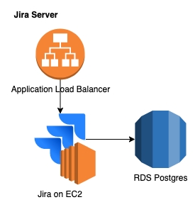

# AWS Jira Server Terraform Module

Terraform module to create an Atlassian Jira server in AWS.

## Overview



Terraform modules to create the stack:

1. EC2 instance <https://github.com/yegorski/terraform-aws-ec2>.
1. Database (Postgres on RDS): <https://github.com/terraform-aws-modules/terraform-aws-rds>.
1. Application Load Balancer <https://github.com/yegorski/terraform-aws-alb>.

## Usage

Created a `terraform.tfvars` files with the variables to be passed in to the module.

```terraform
module "jira" {
  source = "git::https://github.com/yegorski/terraform-aws-jira.git?ref=master"

  app_name       = "jira"
  aws_account_id = "${var.aws_account_id}"

  database_username = "${var.database_username}"
  database_password = "${var.database_password}"

  public_key = "${var.public_key}"
  ssh_ip     = "${var.ssh_ip}"
  subnet_ids = "${data.aws_subnet_ids.public.ids}"
  vpc_id     = "${data.terraform_remote_state.account.vpc_id}"
  region     = "us-east-1"

  tags = {
    Owner       = "yegorski"
    Environment = "production"
    Source      = "https://github.com/yegorski/terraform-aws/jira"
  }
}
```
